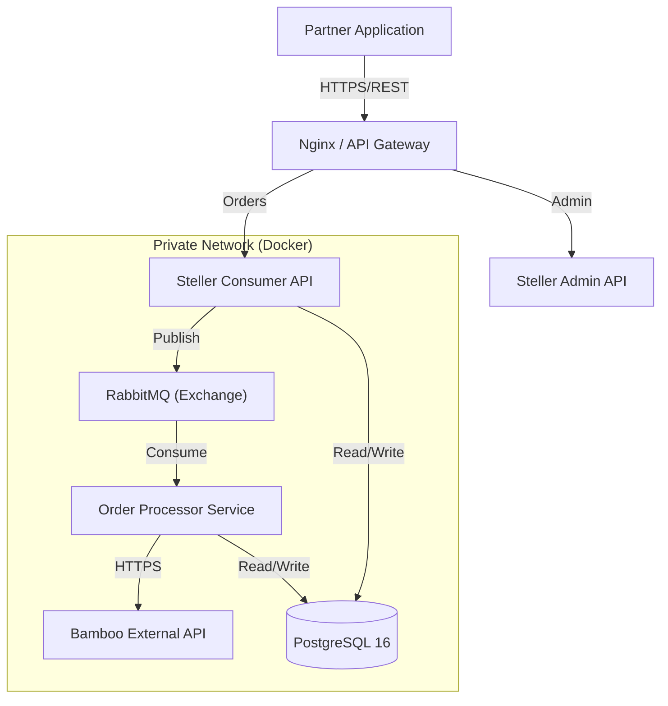

# Steller Platform: System Design Specification

**Classification:** Public / Reference Architecture
**Version:** 1.0.0
**Author:** Muhanad Abdelrahim

---

## 1. Architectural Patterns
*   **Microservices Hybrid:** Core business logic is decoupled into "Producer" (Order Entry) and "Consumer" (Fulfillment) services to ensure separation of concerns.
*   **Event-Driven:** Leverages **RabbitMQ** (via MassTransit) for asynchronous order fulfillment, mitigating dependency risk during upstream provider outages.
*   **Infrastructure as Code (IaC):** Fully containerized environment using **Docker Compose** for high-fidelity, reproducible deployments across environments.

## 2. High-Level Design (Topology)

## 3. Data Persistence & Schema Design
*   **Order (Transactional):** Utilizes `UUID` primary keys to support distributed system traceability and prevent ID enumeration.
*   **OrderItem (Line Item):** Implements a "Snapshot" pattern, storing `ProductFaceValue` at the time of purchase to ensure financial auditability regardless of catalog updates.
*   **PartnerWallet (Ledger):** Employs strict concurrency controls to manage credit balances and prevent race conditions during high-volume order ingestion.

## 4. Technology Selection Strategy
*   **Runtime:** .NET 9 (LTS) — Selected for its enterprise-grade performance and robust async/await patterns.
*   **Database:** PostgreSQL 16 — Chosen for ACID compliance and native support for relational card data.
*   **Message Broker:** RabbitMQ — Provides a resilient "Store and Forward" mechanism for financial transactions.
*   **Frontend:** Vue.js (Vuexy Template) — Accelerated development of the Partner and Admin dashboards with a modern, responsive UI.

## 5. Information Assurance (Security)
*   **Secret Management:** Zero-knowledge credential policy. All API keys and connection strings are injected via runtime environment variables.
*   **Network Perimeter:** Database and Message Broker instances are isolated within an internal Docker bridge network, unreachable from the public internet.
